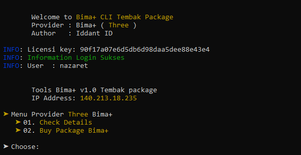
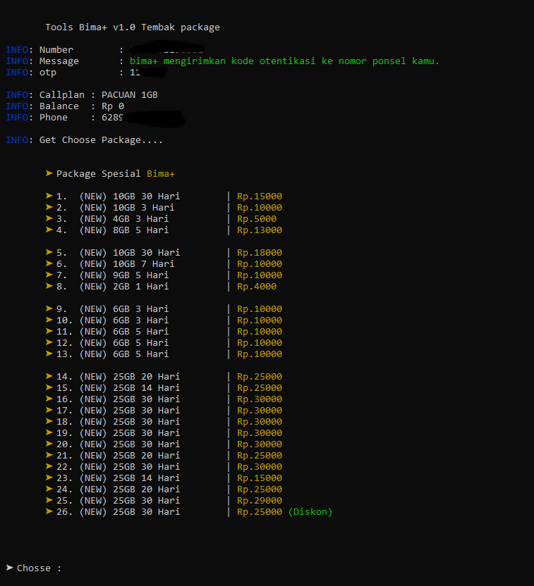

# Simple Script Bima+ Tembak Paket
```shell
Script actived for termux only not pc
Request for me for allowed pc
```

# Example view tools Bima+
<center></center>
<center></center>


# Fiture Script Three
```shell
- Check Details Package
- Buy Package With Details Package
- New Package Promo Three
```

# Download Apps Termux in F-DROID 
```shell
https://f-droid.org/repo/com.termux_117.apk

- Jika sudah anda download maka lanjut ke step di bawah ini 
  anda ketikan di apps termux kalian yang sudah kalian install ya.

- Step di bawah ini untuk install tools nya.
```

# Installations
```shell
git clone https://github.com/ipkzone/three
cd three
php main.php --three

Note: need licensi for aktivasi login in tools
```

install command in 

```shell
pkg update && pkg upgrade
pkg install curl && php7
```

# Usage
- Termux Android
```shell
php main.php --three
```

# Buy License key for aktivasi login
```shell
Join Whatsapp: https://chat.whatsapp.com/Bn8JeZTOco6B19n0BkKsNe
```

# Note
The script runs with the license key,
if you don't have a license key then you can't run it,
to get a license key you have to ask the creator for its activation for a donation of course,
This script blocks multiple user logins so that the script remains safe and secure.

regards,
**Iddant ID**
